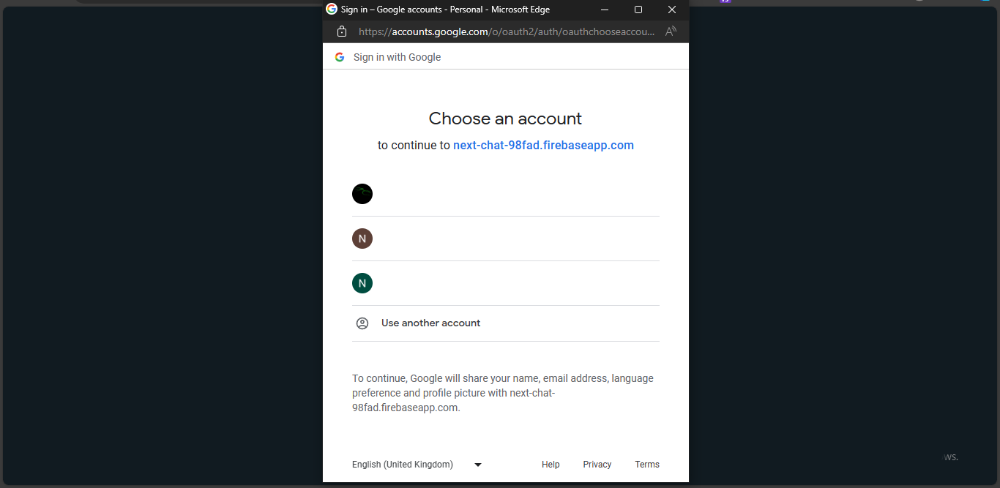
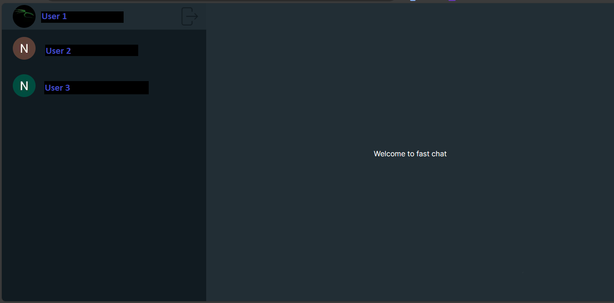
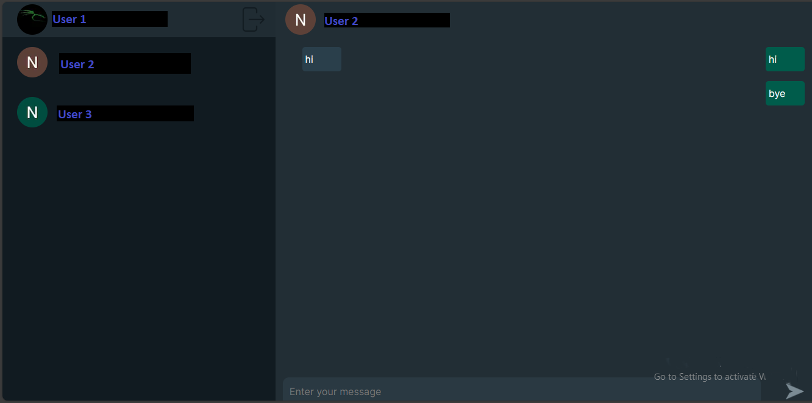
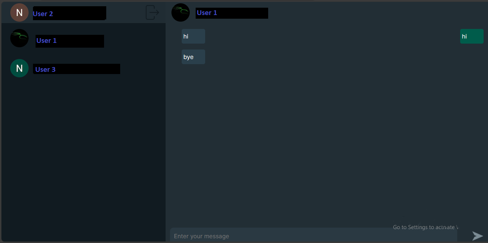

<!-- Improved compatibility of back to top link: See: https://github.com/othneildrew/Best-README-Template/pull/73 -->
<a id="readme-top"></a>

## Fast Chat
<!-- PROJECT Summary -->
<br />

<div align="center">
  <p align="center">
    An Chatting app built with next js and firebase
    <br/>
    <a href="https://github.com/Nitin1-singh/fast-chat/issues">Report Bug</a>
    .
    <a href="https://github.com/Nitin1-singh/fast-chat/issues">Request Feature</a>
  </p>
</div>
<br />
<!-- PROJECT SHIELDS -->
<div align="center">

  
  
  
  
  
  
</div>

<br />

<!-- TABLE OF CONTENTS -->
<details>
  <summary>Table of Contents</summary>
  <ol>
    <li>
      <a href="#about-the-project">About The Project</a>
      <ul>
        <li><a href="#built-with">Built With</a></li>
        <li><a href="#layout">Layout of the project</a></li>
      </ul>
    </li>
    <li>
      <a href="#getting-started">Getting Started</a>
      <ul>
        <li><a href="#prerequisites">Prerequisites</a></li>
        <li><a href="#installation">Installation</a></li>
      </ul>
    </li>
    <li><a href="#contributing">Contributing</a></li>
    <li><a href="#license">License</a></li>
    <li><a href="#contact">Contact</a></li>
  </ol>
</details>

<a id="layout"></a>
## Layout of the project
  All info is hided in below images on purpose for security and privacy reason
  * Sign in Page
  <div>
    
  </div>
  <div>
    
  </div>
  * Main page
  <div>
    
  </div>
  * 1-1 chat
   <div>
    
  </div>
   <div>
    
  </div>

<!-- ABOUT THE PROJECT -->
## About The Project

Hello, this is version 1 of my online Chating app, which is now accessible on GitHub. It is an inital model of my app for 2023.  

My Chat App i.e fast chat current feature:

* Responsive for laptop only  
* Sign in with google option 
* Secure
* Fast and responsible
* 1 to 1 Chat

<p align="right">(<a href="#readme-top">back to top</a>)</p>


### Built With

The tools I employed for my portfolio

* 
* 
* 
* 
* 
* 
* 
* 
* 

<p align="right">(<a href="#readme-top">back to top</a>)</p>

## Tour of the App


<!-- GETTING STARTED -->
## Getting Started

To duplicate my work, follow the guidelines listed below.

### Prerequisites

The list of software you need:

* Latest Version of Node
* Latest Version of Git
* An account on firebase

### Installation

1. Install node in your desktop  
2. Clone the repo
   ```sh
   git clone https://github.com/Nitin1-singh/portfolio-v1.git
   ```
3. Install NPM packages
   ```sh
   npm install
   ```
4. Edit the following in .env 
    ```sh
    NEXT_PUBLIC_FIREBASE_API_KEY="data"    NEXT_PUBLIC_FIREBASE_AUTH_DOMAIN="data"
    NEXT_PUBLIC_FIREBASE_PROJECT_ID="data"
    NEXT_PUBLIC_FIREBASE_STORAGE_BUCKET="data"
    NEXT_PUBLIC_FIREBASE_SENDER_ID="data"
    NEXT_PUBLIC_FIREBASE_APP_ID="data"
    NEXT_PUBLIC_FIREBASE_MESAURNMENT_ID="data"
    ```

<p align="right">(<a href="#readme-top">back to top</a>)</p>

<!-- CONTRIBUTING -->
## Contributing

Contributions are what make the open source community such an amazing place to learn, inspire, and create. Any contributions you make are **greatly appreciated**.

If you have a suggestion that would make this better, please fork the repo and create a pull request. You can also simply open an issue with the tag "enhancement".
Don't forget to give the project a star! Thanks again!

1. Fork the Project
2. Create your Feature Branch (`git checkout -b feature/AmazingFeature`)
3. Commit your Changes (`git commit -m 'Add some AmazingFeature'`)
4. Push to the Branch (`git push origin feature/AmazingFeature`)
5. Open a Pull Request

<p align="right">(<a href="#readme-top">back to top</a>)</p>


<!-- LICENSE -->
## License

Distributed under the MIT License. See `LICENSE.txt` for more information.

<p align="right">(<a href="#readme-top">back to top</a>)</p>


<!-- CONTACT -->
## Contact

Linkden - [Linkden](https://www.linkedin.com/in/nitin-singh-negi-9b6a95297/)

Project Link- [github](https://github.com/Nitin1-singh/fast-chat)

<p align="right">(<a href="#readme-top">back to top</a>)</p>
